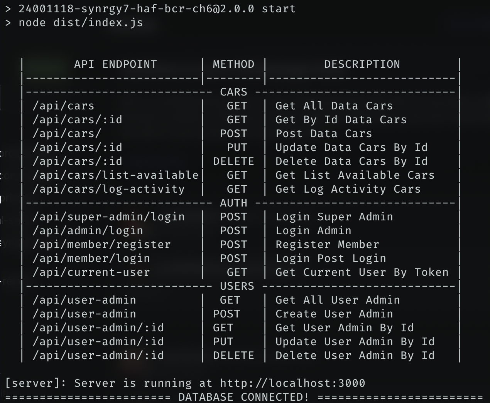

### SYNRGY 7 BINAR CHALLENGE 7 RESTFUL API FOR REACT INTEGRATION FSW 2 HAFIIDH LUQMANUL HAKIM

### DISCLAIMER
- MAKE SURE RUNNING BACKEND AND FRONTEND!

### INSTRUCTION FOR BACKEND
1. Clone project into your local
2. Change directory to this project folder `cd 24001160-synrgy7-haf-bcr-ch7/be`
3. Use command `npm install`
4. Next step use command `npm run compile` to compile TypeScript into JavaScript
5. Make sure copy `.env.example` file to `.env` and fill up the correct value of your PostgreSQL connection!
6. Run this command `node -e "console.log(require('crypto').randomBytes(32).toString('hex'))"` and copy the value into your `.env` file in `JWT_SECRET`
7. Run command `npx knex migration:latest` to create table via migration
8. Run command `npx knex seed:up` to fill up table with data seeder!
9. For final step run command `npm run start`
10. Make sure database already connected to your project like this
   

11. for super admin login, use email `superadmin@email.com` and password `superadmin`
12. Access endpoint `/api-docs` for Swagger Documentation API
13. Your Backend is ready to use! Move to Frontend installation step!

### INSTRUCTION FOR FRONTEND
1. Change directory to this project folder `cd 24001160-synrgy7-haf-bcr-ch7/fe`
2. Use command `npm install`
3. Next step use command `npm run build` to compile React for production use!
4. Or Use `npm run dev` for running React as development (IT'S UP TO YOU!)
5. Make sure copy `.env.example` file to `.env` and fill up the `VITE_API_BASE_URL` with your backend API URL (MAKE SURE YOU FILL UP CORRECTLY OR THE REACT CAN'T BE USED!)
6. Cek your terminal or CMD or powershell the url localhost of vite you run. If you running `npm run dev` it would show `http://localhost:5173` and for the production preview `npm run preview` it would show `http://localhost:4173`.
7. For access login form superadmin `http://localhost:5173/superadmin/login`
8. For access login form admin `http://localhost:5173/admin/login`
9. For access login form member `http://localhost:5173/member/login`
10. For access register form member `http://localhost:5173/member/register`
11. ENJOY THE POWER OF FULLSTACK APP!
